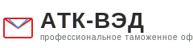

# Логотип АТК-ВЭД

## Описание

Логотип состоит из геометрической фигуры с тремя треугольниками:
- **Синий треугольник** (верхний левый) - #4A90E2
- **Красный треугольник** (нижний левый) - #E31E24
- **Оранжевый треугольник** (верхний правый) - #FF6B35
- **Черные разделительные линии** - #000, толщина 2px

## Файлы

### logo.svg
**Формат:** SVG (векторный)  
**Размер:** 40x40px  
**Использование:** Встроен в header.php, также доступен как отдельный файл

### Как использовать

#### 1. В WordPress Customizer
1. Перейдите в **Внешний вид → Настроить → Идентичность сайта**
2. Нажмите **Выбрать логотип**
3. Загрузите файл `logo.svg` или создайте PNG версию
4. Сохраните изменения

#### 2. Как изображение в коде
```php
/images/logo.svg" alt="АТК-ВЭД" width="40" height="40">
```

#### 3. Как фон в CSS
```css
.logo {
    background-image: url('../images/logo.svg');
    background-size: contain;
    background-repeat: no-repeat;
    width: 40px;
    height: 40px;
}
```

## Создание PNG версии

### Онлайн конвертеры:
1. **CloudConvert** - https://cloudconvert.com/svg-to-png
2. **Convertio** - https://convertio.co/svg-png/
3. **SVG to PNG** - https://svgtopng.com/

### Рекомендуемые размеры PNG:
- **40x40px** - для header (1x)
- **80x80px** - для header (2x retina)
- **120x120px** - для header (3x retina)
- **512x512px** - для favicon и иконок приложений

### Настройки экспорта:
- Формат: PNG
- Прозрачный фон: Да
- Качество: Максимальное
- Цветовое пространство: sRGB

## Favicon

Для создания favicon из логотипа:

### 1. Создайте PNG версии:
- 16x16px - favicon.ico (маленький)
- 32x32px - favicon.ico (средний)
- 180x180px - apple-touch-icon.png (iOS)
- 192x192px - android-chrome-192x192.png (Android)
- 512x512px - android-chrome-512x512.png (Android)

### 2. Используйте генератор favicon:
- **RealFaviconGenerator** - https://realfavicongenerator.net/
- **Favicon.io** - https://favicon.io/

### 3. Разместите файлы:
```
wp-content/themes/atk-ved/
├── favicon.ico
├── apple-touch-icon.png
├── android-chrome-192x192.png
└── android-chrome-512x512.png
```

### 4. Добавьте в header.php:
```php
<link rel="icon" type="image/x-icon" href="<?php echo get_template_directory_uri(); ?>/favicon.ico">
<link rel="apple-touch-icon" sizes="180x180" href="<?php echo get_template_directory_uri(); ?>/apple-touch-icon.png">
<link rel="icon" type="image/png" sizes="32x32" href="<?php echo get_template_directory_uri(); ?>/favicon-32x32.png">
<link rel="icon" type="image/png" sizes="16x16" href="<?php echo get_template_directory_uri(); ?>/favicon-16x16.png">
```

## Цветовая палитра

### Основные цвета логотипа:
```css
--logo-blue: #4A90E2;    /* Синий треугольник */
--logo-red: #E31E24;     /* Красный треугольник */
--logo-orange: #FF6B35;  /* Оранжевый треугольник */
--logo-black: #000000;   /* Разделительные линии */
```

### Использование в дизайне:
- **Синий** - доверие, профессионализм, логистика
- **Красный** - энергия, действие, акценты (кнопки, ссылки)
- **Оранжевый** - тепло, дружелюбие, оптимизм
- **Черный** - структура, четкость, границы

## Вариации логотипа

### Монохромная версия (для печати):
```svg
<svg width="40" height="40" viewBox="0 0 40 40" fill="none">
    <path d="M0 0 L20 0 L0 20 Z" fill="#000"/>
    <path d="M0 20 L20 40 L0 40 Z" fill="#000"/>
    <path d="M20 0 L40 20 L20 20 Z" fill="#000"/>
    <line x1="0" y1="0" x2="40" y2="40" stroke="#fff" stroke-width="2"/>
    <line x1="0" y1="20" x2="20" y2="0" stroke="#fff" stroke-width="2"/>
</svg>
```

### Белая версия (для темного фона):
```svg
<svg width="40" height="40" viewBox="0 0 40 40" fill="none">
    <path d="M0 0 L20 0 L0 20 Z" fill="#fff"/>
    <path d="M0 20 L20 40 L0 40 Z" fill="#fff"/>
    <path d="M20 0 L40 20 L20 20 Z" fill="#fff"/>
    <line x1="0" y1="0" x2="40" y2="40" stroke="#000" stroke-width="2"/>
    <line x1="0" y1="20" x2="20" y2="0" stroke="#000" stroke-width="2"/>
</svg>
```

## Правила использования

### ✅ Можно:
- Использовать на белом или светлом фоне
- Масштабировать пропорционально
- Размещать с достаточным свободным пространством
- Использовать в социальных сетях
- Печатать на визитках и документах

### ❌ Нельзя:
- Изменять цвета треугольников
- Искажать пропорции (растягивать)
- Добавлять эффекты (тени, градиенты)
- Размещать на пестром фоне
- Использовать размер меньше 16x16px

## Минимальные размеры

- **Веб:** 16x16px (favicon)
- **Печать:** 10mm x 10mm
- **Экран:** 40x40px (рекомендуемый)

## Свободное пространство

Вокруг логотипа должно быть свободное пространство:
- Минимум: 10px со всех сторон
- Рекомендуемо: 20px со всех сторон

## Примеры использования

### В header:
```html
<div class="logo-icon">
    <svg width="40" height="40">...</svg>
</div>
<div class="logo-text">
    <span class="logo-name">АТК-ВЭД</span>
    <span class="logo-tagline">профессиональное таможенное оформление</span>
</div>
```

### В footer:
```html

```

### В email подписи:
```html

```

## Поддержка

При возникновении проблем:
1. Проверьте путь к файлу логотипа
2. Убедитесь, что SVG поддерживается браузером
3. Используйте PNG fallback для старых браузеров
4. Проверьте права доступа к файлу (644)

---

**Версия:** 1.4  
**Дата:** 25 февраля 2026  
**Автор:** АТК-ВЭД
